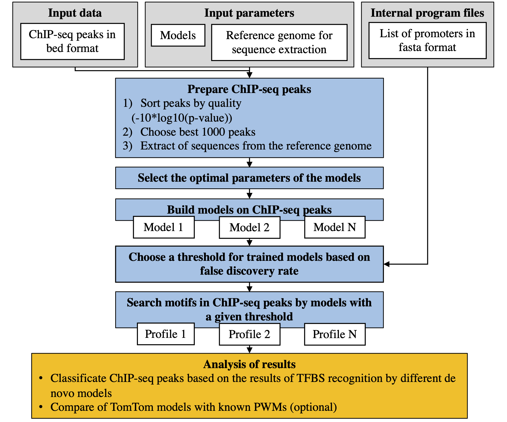

# Pipeline for integration different models of transcription factor binding sites

## Introduction
Regulation of eukaryotic gene expression achieved through compound interaction of various transcription factors (TFs). Development and massive application of next generation sequencing technologies for mapping of TF binding sites (BS) in genome, in particular ChIP-seq, provides an opportunity to study gene expression regulation in detail. Widely applied approach of TFBS prediction, the position weight matrix (PWM) relied on a relatively short motifs and proposed the additivity of various positions within potential TFBS [1,2]. Recently, to supplement the verification of potential BSs in ChIP-seq data with PWMs, various approaches that taking into account intra-motifs dependencies were applied for wide-genome application, e.g. BaMM [3] and InMode [4]. These approaches use the markov models (MMs), which neglect the additivity assumption through the concept of the order of markov chain, i.e. a short distance for a given position that may contain other dependent nucleotides. Typically, the order of MM is changed from one to five, that’s way MMs may be referred as to as ‘short-range interaction’ models.
To compare traditional PWMs with BAMM/InMode models we developed the integrated pipeline for ChIP-seq data verification with multiple de novo motif search models.

## Scheme of pipeline



## Requirements

TOOLS:
  * bedtools: https://bedtools.readthedocs.io/en/latest/

MODELS:
  * BaMM: https://github.com/soedinglab/BaMMmotif2  
  * ChIPmunk: http://autosome.ru/ChIPMunk/  
  * InMoDe: http://jstacs.de/index.php/InMoDe

OPTIONAL:
  * TomTom: http://meme-suite.org/index.html

## Installation

```  
git clone https://github.com/ubercomrade/pipeline.git  
cd pipeline/  
pip3 install -e .  
```

## Usage
The command `pipeline.py -h` return:

```
usage: pipeline.py [-h] [-t TRAIN_SIZE] [-f FPR] [-T TEST_SIZE] -I INMODE
                   [-J JAVA] -c CHIPMUNK [-C CPU_COUNT] [-m PATH_TO_MDB]
                   bed N genome output N [N ...]

positional arguments:
  bed                   path to BED file
  N                     promoters of organism (hg38, mm10)
  genome                path to genome fasta file
  output                output dir
  N                     list of models to use (pwm, bamm, inmode, sitega)

optional arguments:
  -h, --help            show this help message and exit
  -t TRAIN_SIZE, --train TRAIN_SIZE
                        size of training sample, by default size is equal to
                        2000
  -f FPR, --FPR FPR     FPR, def=1.9*10^(-4)
  -T TEST_SIZE, --test TEST_SIZE
                        size of testing sample, by default size is equal to
                        2000
  -I INMODE, --inmode INMODE
                        path to inmode
  -J JAVA, --java JAVA  path to Java
  -c CHIPMUNK, --chipmunk CHIPMUNK
                        path to chipmunk
  -C CPU_COUNT, --processes CPU_COUNT
                        Number of processes to use, default: 2
  -m PATH_TO_MDB, --motifdatabase PATH_TO_MDB
                        path to motif database in meme format for TOMTOM. You
                        can get motif database from http://meme-
                        suite.org/doc/download.html
```
### Example run
```
pipeline.py peaks.bed \
hg38 \
/path/to/the/genome/hg38.fa \
./name_of_directory_to_write_results \
pwm bamm inmode \
-t 500 -T 1000 -C 4 \
-I /path/to/inmode/InMoDeCLI-1.1.jar \
-c /path/to/ChIPmunk/chipmunk.jar 
```

### Required options description

**First positional argument**:
```
bed                   path to BED file
```
You shuld give path to bed file. The file should contain the following columns separated by tab:
1. chromosome
2. start
3. end
4. name
5. score

Additional columns can be in file but not required. Information about bed format is avaliable in: https://m.ensembl.org/info/website/upload/bed.html, https://genome.ucsc.edu/FAQ/FAQformat.html#format1

**Second positional argument**:
```
N                     promoters of organism (hg38, mm10)
```
Value of N can be _hg38_ or _mm10_. Depend on organism usage in research

**Third positional argument**:
```
genome                path to genome fasta file
```
You shuld give path to fasta file. It's required to get sequences for peaks by bedtools.
Reference genomes for mm10/hg38 can be downloaded from https://www.gencodegenes.org/ or https://genome.ucsc.edu/


**Fourth positional argument**:
```
output                output dir
```
Path of directory to write results. If dir is not exists it'll be created.


**Fifth positional argument**:
```
N                     list of models to use (pwm, bamm, inmode, sitega)
```
Argument can take several values from the list: pwm, bamm, inmode, sitega. All values must be separated by space. Example: `pwm bamm`, `pwm bamm inmode`, `pwm bamm inmode`, `pwm sitega` 
*IMPORTANT!* Option `bamm` must be used with `pwm`. Becouse PWM model initializes BaMM

### Optional options description

## Useful links

 * [Cistrome](http://cistrome.org/ap/) [5]

## Reference

[1]	Benos P.V. et al. (2002) Additivity in protein-DNA interactions: how good an approximation is it? Nucleic Acids Res., 30(20):4442-4451.  
[2]	Srivastava D and Mahony S. (in press) Sequence and chromatin determinants of transcription factor binding and the establishment of cell type-specific binding patterns. Biochim Biophys Acta Gene Regul Mech., 194443. doi: 10.1016/j.bbagrm.2019.194443.  
[3]	Siebert M. and Söding J. (2016) Bayesian Markov models consistently outperform PWMs at predicting motifs in nucleotide sequences. Nucleic Acids Res., 44(13):6055–6069.  
[4]	Eggeling R. et al. (2017) InMoDe: tools for learning and visualizing intra-motif dependencies of DNA binding sites. Bioinformatics, 33(4):580-582.  
[5]	Mei S. et al. (2017) Cistrome Data Browser: a data portal for ChIP-Seq and chromatin accessibility data in human and mouse, Nucleic Acids Res., 45(D1):, D658–D662,.  

## License

Copyright (c) 2020 Anton Tsukanov

Permission is hereby granted, free of charge, to any person obtaining a copy
of this software and associated documentation files (the "Software"), to deal
in the Software without restriction, including without limitation the rights
to use, copy, modify, merge, publish, distribute, sublicense, and/or sell
copies of the Software, and to permit persons to whom the Software is
furnished to do so, subject to the following conditions:

The above copyright notice and this permission notice shall be included in all
copies or substantial portions of the Software.

THE SOFTWARE IS PROVIDED "AS IS", WITHOUT WARRANTY OF ANY KIND, EXPRESS OR
IMPLIED, INCLUDING BUT NOT LIMITED TO THE WARRANTIES OF MERCHANTABILITY,
FITNESS FOR A PARTICULAR PURPOSE AND NONINFRINGEMENT. IN NO EVENT SHALL THE
AUTHORS OR COPYRIGHT HOLDERS BE LIABLE FOR ANY CLAIM, DAMAGES OR OTHER
LIABILITY, WHETHER IN AN ACTION OF CONTRACT, TORT OR OTHERWISE, ARISING FROM,
OUT OF OR IN CONNECTION WITH THE SOFTWARE OR THE USE OR OTHER DEALINGS IN THE
SOFTWARE.